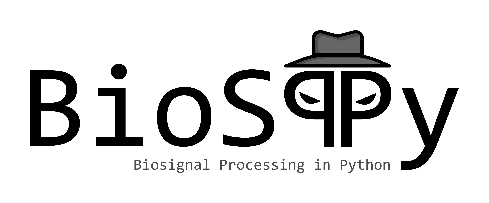

Welcome to ``BioSPPy``
======================

``BioSPPy`` is a toolbox for biosignal processing written in Python.
The toolbox bundles together various signal processing and pattern
recognition methods geared torwards the analysis of biosignals.

Highlights:

-  Support for various biosignals: PPG, ECG, EDA, EEG, EMG, Respiration
-  Signal analysis primitives: filtering, frequency analysis
-  Clustering
-  Biometrics

Contents:

.. toctree::
   :maxdepth: 1

   tutorial
   biosppy

Installation
------------

Installation can be easily done with ``pip``:

.. code:: bash

    $ pip install biosppy

Simple Example
--------------

The code below loads an ECG signal from the ``examples`` folder, filters
it, performs R-peak detection, and computes the instantaneous heart
rate.

.. code:: python

    import numpy as np
    from biosppy.signals import ecg

    # load raw ECG signal
    signal = np.loadtxt('./examples/ecg.txt')

    # process it and plot
    out = ecg.ecg(signal=signal, sampling_rate=1000., show=True)

Index
-----

* :ref:`genindex`
* :ref:`modindex`
* :ref:`search`
