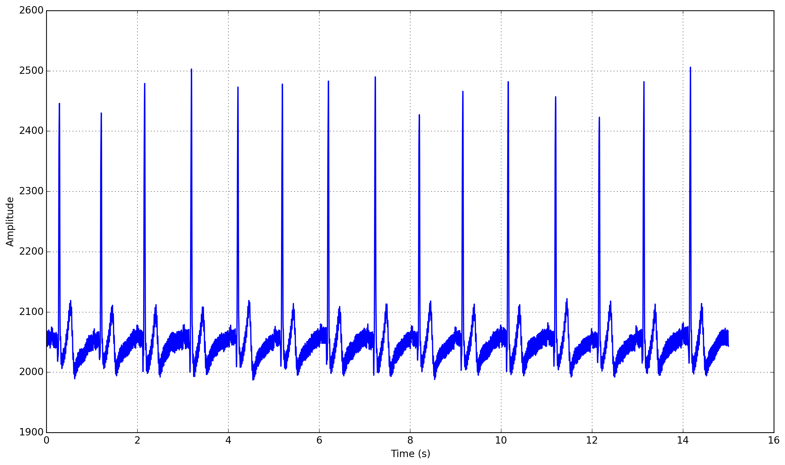
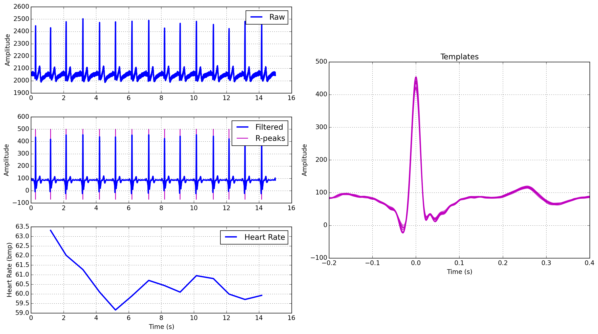

========
Tutorial
========

In this tutorial we will describe how `biosppy` enables the development of
Pattern Recognition and Machine Learning workflows for the analysis of
biosignals. The major goal of this package is to make these tools easily
available to anyone wishing to start playing around with biosignal data,
regardless of their level of knowledge in the field of Data Science. Throughout
this tutorial we will discuss the major features of `biosppy` and introduce the
terminology used by the package.

What are Biosignals?
====================

Biosignals, in the most general sense, are measurements of physical properties
of biological systems. These include the measurement of properties at the
cellular level, such as concentrations of molecules, membrane potentials, and
DNA assays. On a higher level, for a group of specialized cells (i.e. an organ)
we are able to measure properties such as cell counts and histology, organ
secretions, and electrical activity (the electrical system of the heart, for
instance). Finally, for complex biological systems like the human being,
biosignals also include blood and urine test measurements, core body
temperature, motion tracking signals, and imaging techniques such as CAT and MRI
scans. However, the term biosignal is most often applied to bioelectrical,
time-varying signals, such as the electrocardiogram.

The task of obtaining biosignals of good quality is time-consuming,
and typically requires the use of costly hardware. Access to these instruments
is, therefore, usually restricted to research institutes, medical centers,
and hospitals. However, recent projects like `BITalino <http://bitalino.com/>`__
or `OpenBCI <http://openbci.com/>`__ have lowered the entry barriers of biosignal
acquisition, fostering the Do-It-Yourself and Maker communities to develop
physiological computing applications. You can find a list of biosignal
platform `here <https://opensource.com/life/15/4/five-diy-hardware-physiological-computing>`__.

The following sub-sections briefly describe the biosignals
covered by `biosppy`.

Blood Volume Pulse
------------------

Photoplethysmogram (PPG) signals are...

Electrocardiogram
-----------------

Electrocardiogrm (ECG) signals are...

Electrodermal Activity
----------------------

Electrodermal Activity (EDA) signals are...

Electroencephalogram
--------------------

Electroencephalogram (EEG) signals are...

Electromyogram
--------------

Electromyogram (EMG) signals are a measure of the electrical activity of
muscles. There are two types of sensors that can be used to record this
electrical activity, in particular surface EMG (sEMG), measured by non-invasive
electrodes, and intramuscular EMG. Out of the two, sEMG allows for non-invasive
electrodes to be applied at the body surface, that measure muscle activity.
In sEMG, contact with the skin can be done with standard pre-gelled electrodes,
dry Ag/AgCl electrodes or conductive textiles. Normally, there are three
electrodes in an sEMG interface: two electrodes work on bipolar differential
measurement and the other one is attached to a neutral zone, to serve as the
reference point. After being recorded, this signal can be processed in time,
frequency and time-frequency domains. In an EMG signal, when the muscle is in
a relaxed state, this corresponds to the baseline activity. The bursts of
activity match the muscular activations and have a random shape, meaning that
a raw recording of contractions cannot be exactly reproduced. The onset of an
event corresponds to the beginning of the burst.

Respiration
-----------

Respiration (Resp) signals are...

What is Pattern Recognition?
============================

To do.

A Note on Return Objects
========================

Before we dig into the core aspects of the package, you will quickly notice
that many of the methods and functions defined here return a custom object
class. This return class is defined in :py:class:`biosppy.utils.ReturnTuple`.
The goal of this return class is to strengthen the semantic relationship
between a function's output variables, their names, and what is described in
the documentation. Consider the following function definition:

.. code:: python

    def compute(a, b):
        """Simultaneously compute the sum, subtraction, multiplication and
        division between two integers.

        Args:
            a (int): First input integer.
            b (int): Second input integer.

        Returns:
            (tuple): containing:
                sum (int): Sum (a + b).
                sub (int): Subtraction (a - b).
                mult (int): Multiplication (a * b).
                div (int): Integer division (a / b).

        """

        if b == 0:
            raise ValueError("Input 'b' cannot be zero.")

        v1 = a + b
        v2 = a - b
        v3 = a * b
        v4 = a / b

        return v1, v2, v3, v4

Note that Python doesn't actually support returning multiple objects. In this
case, the ``return`` statement packs the objects into a tuple.

.. code:: python

    >>> out = compute(4, 50)
    >>> type(out)
    <type 'tuple'>
    >>> print out
    (54, -46, 200, 0)

This is pretty straightforward, yet it shows one disadvantage of the native
Python return pattern: the semantics of the output elements (i.e. what each
variable actually represents) are only implicitly defined with the ordering
of the docstring. If there isn't a dosctring available (yikes!), the only way
to figure out the meaning of the output is by analyzing the code itself.

This is not necessarily a bad thing. One should always try to understand,
at least in broad terms, how any given function works. However, the initial
steps of the data analysis process encompass a lot of experimentation and
interactive exploration of the data. This is important in order to have an
initial sense of the quality of the data and what information we may be able to
extract. In this case, the user typically already knows what a function does,
but it is cumbersome to remember by heart the order of the outputs, without
having to constantly check out the documentation.

For instance, does the `numpy.histogram
<http://docs.scipy.org/doc/numpy/reference/generated/numpy.histogram.html>`__
function first return the edges or the values of the histogram? Maybe it's the
edges first, which correspond to the x axis. Oops, it's actually the other way
around...

In this case, it could be useful to have an explicit reference directly in the
return object to what each variable represents. Returning to the example above,
we would like to have something like:

.. code:: python

    >>> out = compute(4, 50)
    >>> print out
    (sum=54, sub=-46, mult=200, div=0)

This is exactly what :py:class:`biosppy.utils.ReturnTuple` accomplishes.
Rewriting the `compute` function to work with `ReturnTuple` is simple. Just
construct the return object with a tuple of strings with names for each output
variable:

.. code:: python

    from biosppy import utils

    def compute_new(a, b):
        """Simultaneously compute the sum, subtraction, multiplication and
        division between two integers.

        Args:
            a (int): First input integer.
            b (int): Second input integer.

        Returns:
            (ReturnTuple): containing:
                sum (int): Sum (a + b).
                sub (int): Subtraction (a - b).
                mult (int): Multiplication (a * b).
                div (int): Integer division (a / b).

        """

        if b == 0:
            raise ValueError("Input 'b' cannot be zero.")

        v1 = a + b
        v2 = a - b
        v3 = a * b
        v4 = a / b

        # build the return object
        output = utils.ReturnTuple((v1, v2, v3, v4), ('sum', 'sub', 'mult', 'div'))

        return output

The output now becomes:

.. code:: python

    >>> out = compute_new(4, 50)
    >>> print out
    ReturnTuple(sum=54, sub=-46, mult=200, div=0)

It allows to access a specific variable by key, like a dictionary:

.. code:: python

    >>> out['sum']
    54

And to list all the available keys:

.. code:: python

    >>> out.keys()
    ['sum', 'sub', 'mult', 'div']

It is also possible to convert the object to a more traditional dictionary,
specifically an `OrderedDict <https://docs.python.org/2/library/collections.html#collections.OrderedDict>`__:

.. code:: python

    >>> d = out.as_dict()
    >>> print d
    OrderedDict([('sum', 54), ('sub', -46), ('mult', 200), ('div', 0)])

Dictionary-like unpacking is supported:

.. code:: python

    >>> some_function(**out)

`ReturnTuple` is heavily inspired by `namedtuple <https://docs.python.org/2/library/collections.html#collections.namedtuple>`__,
but without the dynamic class generation at object creation. It is a subclass
of `tuple`, therefore it maintains compatibility with the native return pattern.
It is still possible to unpack the variables in the usual way:

.. code:: python

    >>> a, b, c, d = compute_new(4, 50)
    >>> print a, b, c, d
    54 -46 200 0

The behavior is slightly different when only one variable is returned. In this
case it is necessary to explicitly unpack a one-element tuple:

.. code:: python

    from biosppy import utils

    def foo():
        """Returns 'bar'."""

        out = 'bar'

        return utils.ReturnTuple((out, ), ('out', ))

.. code:: python

    >>> out, = foo()
    >>> print out
    'bar'

A First Approach
================

One of the major goals of `biosppy` is to provide an easy starting point into
the world of biosignal processing. For that reason, we provide simple turnkey
solutions for each of the supported biosignal types. These functions implement
typical methods to filter, transform, and extract signal features. Let's see
how this works for the example of the ECG signal.

The GitHub repository includes a few example signals (see
`here <https://github.com/PIA-Group/BioSPPy/tree/master/examples>`__). To load
and plot the raw ECG signal follow:

.. code:: python

    >>> import numpy as np
    >>> import pylab as pl
    >>> from biosppy import storage
    >>>
    >>> signal, mdata = storage.load_txt('.../examples/ecg.txt')
    >>> Fs = mdata['sampling_rate']
    >>> N = len(signal)  # number of samples
    >>> T = (N - 1) / Fs  # duration
    >>> ts = np.linspace(0, T, N, endpoint=False)  # relative timestamps
    >>> pl.plot(ts, signal, lw=2)
    >>> pl.grid()
    >>> pl.show()

This should produce a similar output to the one shown below.

This signal is a Lead I ECG signal acquired at 1000 Hz, with a resolution of 12
bit. Although of good quality, it exhibits powerline noise interference, has a
DC offset resulting from the acquisition device, and we can also observe the
influence of breathing in the variability of R-peak amplitudes.

We can minimize the effects of these artifacts and extract a bunch of features
with the :py:class:`biosppy.signals.ecg.ecg` function:

.. code:: python

    >>> from biosppy.signals import ecg
    >>> out = ecg.ecg(signal=signal, sampling_rate=Fs, show=True)

It should produce a plot like the one below.

Signal Processing
=================

To do..

Clustering
==========

To do..

Biometrics
==========

To do..

What's Next?
============

To do..

References
==========

To do.
